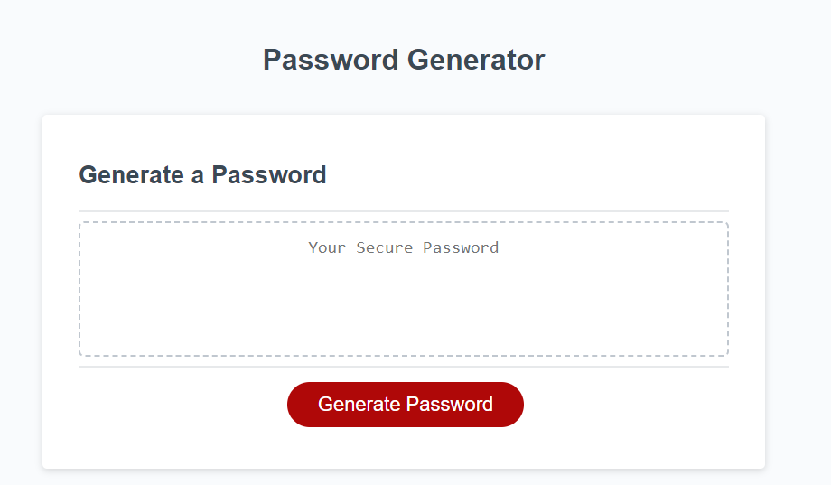
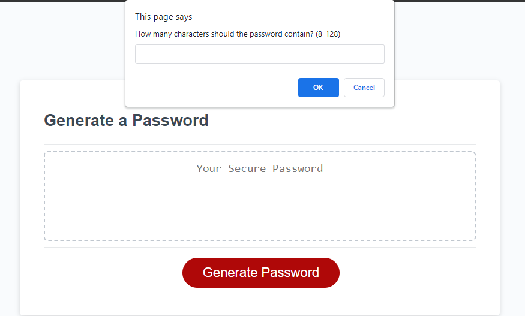
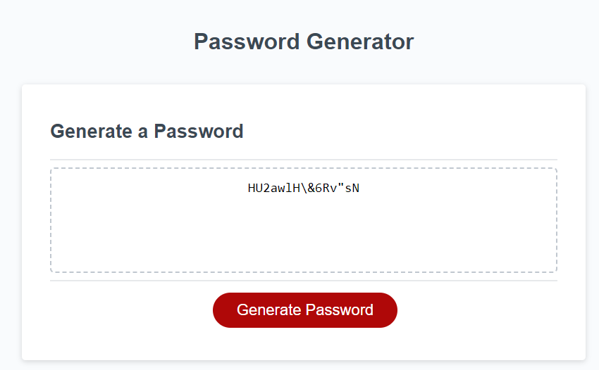

# random-password-generator
This is a code refactor to generate a more secure and random password for users

https://www.w3schools.com/JS/js_random.asp

## Technology Used 

| Technology Used         | Resource URL           | 
| ------------- |:-------------:| 
| HTML    | [https://developer.mozilla.org/en-US/docs/Web/HTML](https://developer.mozilla.org/en-US/docs/Web/HTML) | 
| CSS     | [https://developer.mozilla.org/en-US/docs/Web/CSS](https://developer.mozilla.org/en-US/docs/Web/CSS)      |   
| Git | [https://git-scm.com/](https://git-scm.com/)     |  
| JavaScript | https://developer.mozilla.org/en-US/docs/Web/javascript |

## Description

[Visit the Deployed Site] (https://bryannguyen9.github.io/random-password-generator/)

This project was a code refactor of already built html and css styling with an initial textbox for users to insert text and a 'Generate Password' button. It did not produce any password. 

The functionality that was built in was for users to click the 'Generate Password' button and be able to select from different criteria using confirm/prompt boxes in order to create a secure and randomized password that would when valid and finished would generate a password within the textbox for users.

Again here is a link to my fully deployed website: 
[Site Landing Page](https://bryannguyen9.github.io/random-password-generator/)

## Table of Contents

* [Code Refactor Example](#code-refactor-example)
* [Usage](#usage)
* [Learning Points](#learning-points)
* [Author Info](#author-info)
* [Credits](#credits)
* [License](#license)

## Mock-Up

The following image shows the web application's appearance and functionality:


## Code Refactor Example

Here is an example of my javascript code that allows users to choose from different character sets and then adds it to the main character set. 

A randomizer that is given the length of that finalized character set gets an index from 1 to that finalized length and then uses that index to select a random character from the set and concat it to the finalized password.

```javascript
  // Define character sets to be used based on user input
  var lowercaseChars = "abcdefghijklmnopqrstuvwxyz";
  var uppercaseChars = "ABCDEFGHIJKLMNOPQRSTUVWXYZ";
  var numericChars = "0123456789";
  var specialChars = "!\"#$%&'()*+,-./:;<=>?@[\\]^_`{|}~";

  // Build character set based on user input
  var charSet = "";
      if (includeLowercase) {
        charSet += lowercaseChars;
      }
      if (includeUppercase) {
        charSet += uppercaseChars;
      }
      if (includeNumeric) {
        charSet += numericChars;
      }
      if (includeSpecial) {
        charSet += specialChars;
      }

    // Generate password
    var password = "";
      for (var i = 0; i < length; i++) {
        var randomIndex = Math.floor(Math.random() * charSet.length);
        password += charSet[randomIndex];
      }

    // Return generated password
    return password;
```

## Usage
 
Here you can see the basic home page that was already created at time of code refactor:



Here you can see that when you click the 'Generate Password' button you are prompted to enter the desired length of password using the window prompt functionality:



Here you can see after selecting different criteria assuming you did not enter an invalid length, a secure randomized password is generated within the textbox that is based on the user selected criteria:




## Learning Points 

A lot of time was spent figuring out how to use the random function with javascript. Not only is there a random function but you have to use the built in math library within javascript along with math.floor in order to correctly get the random function to work the way you want it to.

In this certain case of creating a random secure password I had to learn how to incorporate the character set length with the randomizer in order to get a random index of that set length and then incorporate concatenation to create the secure finalized password.

These are references and resources that I used in order to help me learn the ins and outs and overall functionality and use cases of the random feature in javascript:

1. [W3 schools](https://www.w3schools.com/JS/js_random.asp)
2. [Mozilla Developer](https://developer.mozilla.org/en-US/docs/Web/JavaScript/Reference/Global_Objects/Math/random)
3. [Stack-Overflow](https://stackoverflow.com/questions/1527803/generating-random-whole-numbers-in-javascript-in-a-specific-range)

## About Me

Hi, my name is Bryan Nguyen I am an up and coming full-stack web developer working
on getting into the space with projects that support both my growth, belief, and imagination. I hope to one day work within the realm of AI, web-development, and even site-reliability/the space of cyber-security.

## My links

* [Portfolio](https://bryannguyen9.github.io/Bryan-Nguyen-Portfolio/)
* [LinkedIn](https://linkedin.com/in/bryannguyen9)
* [Github](https://github.com/bryannguyen9)


## Credits

### Special thanks to David Chung: 
 
 * His Github Portfolio: [David-Chung-Github](https://github.com/dchung13/)
 * His Linked-In: [David-Chung-LinkedIn](https://www.linkedin.com/in/david-chung-77141526b/)
 * His Portfolio Site: [David-Chung-Portfolio](https://dchung13.github.io/David-Chung-Portfolio/) 

### Special thanks to these reference websites that taught me different functionalities within my website for me to create a seamless experience for users.

1. [W3 Schools](https://www.w3schools.com/JS/js_random.asp)
2. [Mozilla](https://developer.mozilla.org/en-US/docs/Web/JavaScript/Reference/Global_Objects/Math/random)
3. [Stack-Overflow](https://stackoverflow.com/questions/1527803/generating-random-whole-numbers-in-javascript-in-a-specific-range)


### License

MIT License

Copyright (c) [2023] [Bryan-Nguyen]

Permission is hereby granted, free of charge, to any person obtaining a copy
of this software and associated documentation files (the "Software"), to deal
in the Software without restriction, including without limitation the rights
to use, copy, modify, merge, publish, distribute, sublicense, and/or sell
copies of the Software, and to permit persons to whom the Software is
furnished to do so, subject to the following conditions:

The above copyright notice and this permission notice shall be included in all
copies or substantial portions of the Software.

THE SOFTWARE IS PROVIDED "AS IS", WITHOUT WARRANTY OF ANY KIND, EXPRESS OR
IMPLIED, INCLUDING BUT NOT LIMITED TO THE WARRANTIES OF MERCHANTABILITY,
FITNESS FOR A PARTICULAR PURPOSE AND NONINFRINGEMENT. IN NO EVENT SHALL THE
AUTHORS OR COPYRIGHT HOLDERS BE LIABLE FOR ANY CLAIM, DAMAGES OR OTHER
LIABILITY, WHETHER IN AN ACTION OF CONTRACT, TORT OR OTHERWISE, ARISING FROM,
OUT OF OR IN CONNECTION WITH THE SOFTWARE OR THE USE OR OTHER DEALINGS IN THE
SOFTWARE.
